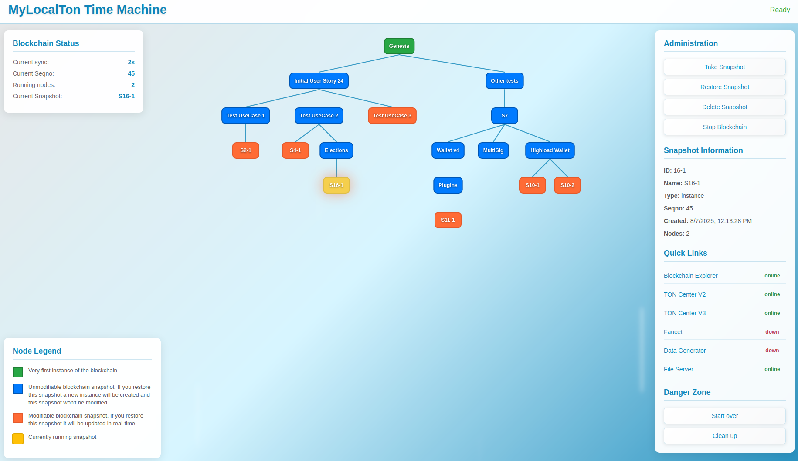

# MyLocalTon Docker

MyLocalTon allows you quickly to set up and launch your own [TON blockchain](https://github.com/ton-blockchain/ton) with
up to 6 validators.
To facilitate the development process it also includes services like
[TON-HTTP-API V2](https://github.com/toncenter/ton-http-api), [TON Indexer V3](https://github.com/toncenter/ton-indexer),
Time Machine, Faucet and Random Data Generator.



## Prerequisites

Installed Docker Engine or Docker desktop and docker-compose.

We recommend to start with [Docker Desktop](https://www.docker.com/products/docker-desktop/). It includes docker-compose
already.

- docker-compose installation

``` bash
sudo curl -L "https://github.com/docker/compose/releases/download/v2.6.0/docker-compose-$(uname -s)-$(uname -m)" -o /usr/local/bin/docker-compose
sudo chmod +x /usr/local/bin/docker-compose
```

## Usage

### Quick start

Uncomment sections in ```docker-compose.yaml``` to enable more validators and services.

[Download](./docker-compose.yaml) and start the main `docker-compose.yaml` file. For Mac/Linux use the command below.

```bash
wget https://raw.githubusercontent.com/neodix42/mylocalton-docker/refs/heads/main/docker-compose.yaml
wget https://raw.githubusercontent.com/neodix42/mylocalton-docker/refs/heads/main/.env
```

Modify .env file as per your requirements. By default, MyLocalTon uses TON image with the `latest` tag.
You can change it by setting TON_BRANCH in .env file. For example to `testnet`.

```bash
docker-compose up -d
```

Now you can navigate to Time Machine by opening http://localhost:8083.

By default, the following services will be available on start:

| Service name        | Link                                                                                     | 
|---------------------|------------------------------------------------------------------------------------------|
| Time Machine        | http://127.0.0.1:8083/                                                                   | 
| TON-HTTP-API V2     | http://127.0.0.1:8082/                                                                   | 
| Blockchain explorer | http://127.0.0.1:8080/last                                                               |
| Http File Server    | http://127.0.0.1:8000/                                                                   |
| Lite-server         | `lite-client -a 127.0.0.1:40004 -b E7XwFSQzNkcRepUC23J2nRpASXpnsEKmyyHYV4u/FZY= -c last` |
| Faucet              | http://127.0.0.1:88                                                                      |
| Data generation     | http://127.0.0.1:99/                                                                     |
| Indexer API v3      | http://127.0.0.1:8081/                                                                   |

### Deploying optional services

To deploy optional services, you may use Compose profiles

```
docker compose --profile indexer --profile data --profile faucet up -d
```

or change `COMPOSE_PROFILES` variable in `.env` file.

Available profiles:

- `blockchain-explorer`: enables default native TON blockchain explorer
- `lite-server`: deploys external TON lite-server, by default one runs as embedded inside genesis container
- `time-machine`: deploys Time Machine service
- `faucet`: deploys faucet service to get coins to some special address
- `data`: generates some activity with TON, Jettons and NFTs
- `validators-<N>`: launches N validators in addition to genesis node, for example `validators-2` enables 2 additional
  validators.
- `indexer`: deploys TON Center API v3
- `indexer-minimal`: deploys API v3 without a trace classifier

### Containers' description and startup parameters

Adjust parameters in `.env` file or edit `docker-compose.yaml` for relevant changes.

<table>
<tbody>
<tr>
<th>Container</th>
<th>Parameters</th>
<th>Description</th>
</tr>
<tr>
<td>genesis</td>
<td>
<ul><li><b>EXTERNAL_IP</b> - used to generate <b>external.global.config.json</b> that allows remote users to connect to lite-server via  public IP. Default <b>empty</b>, i.e. no <b>external.global.config.json</b> will be generated;</li> 
<li><b>NEXT_BLOCK_GENERATION_DELAY</b> - used to set blocks generation rate per second. Default value 2 (seconds), that means 1  block in 2 seconds. Can also be set to less than a second, e.g. 0.5; </li>
<li><b>VALIDATION_PERIOD</b> - set validation period in seconds, default <b>1200 (20 min)</b>; </li>
<li><b>MASTERCHAIN_ONLY</b> - set to <b>true</b> if you want to have only masterchain, i.e. without workchains, default <b>false</b>; </li>
<li><b>DHT_PORT</b> - set port (udp) for dht server, default port <b>40004</b>, optional.</li>
<li><b>CUSTOM_PARAMETERS</b> - used to specify validator's command line parameters, default - empty string (no parameters),  optional. </li>
<li><b>ENABLE_FILE_HTTP_SERVER</b> - used to enable file http server inside genesis container on port 8888, default - false,  optional. </li>
</ul>
You can also adjust other blockchain settings, like storage or cell creation price, initial blockchain balance and so
on.

The whole list of supported parameters can be
found <a href="https://github.com/neodix42/mylocalton-docker/wiki/Genesis-setup-parameters">here</a>.
</td>
<td>
This is the very first and default validator of initial TON blockchain. 
It creates the so-called zero state with specified parameters.
The default parameters for this local TON blockchain are the same as in the Mainnet.
</td>
</tr>
<tr>
<td>time-machine</td>
<td>
<ul>
<li><b>SERVER_PORT</b> - used by time machine service, default port <b>8083</b>, optional;</li>
</ul>
</td>
<td>
This is the face of MyLocalTon Docker. 
Here you can take the snapshots of your TON blockchain and navigate between them as you like,
or you can use it simply to stop and start the blockchain, as well as to customize and start it from scratch. 
</td>
</tr>
<tr>
<td>faucet</td>
<td>
<ul>
<li><b>FAUCET_USE_RECAPTCHA</b> - if <b>false</b> faucet will not use recaptcha as protection, mandatory, default <b>true</b>;</li>
<li><b>RECAPTCHA_SITE_KEY</b> - used by local http-server that runs faucet service, mandatory;</li>
<li><b>RECAPTCHA_SECRET</b> - used by local http-server that runs faucet service, mandatory;</li>
<li><b>FAUCET_REQUEST_EXPIRATION_PERIOD</b> - used by local http-server that runs faucet service, default <b>86400</b> seconds (24h), optional;</li>
<li><b>FAUCET_SINGLE_GIVEAWAY</b> - used by local http-server that runs faucet service, default <b>10</b> toncoins, optional;</li>
<li><b>SERVER_PORT</b> - used by local http-server that runs faucet service, default port <b>88</b>, optional.</li>
</ul>
</td>
<td>
This services allows users to get test toncoins. 
</td>
</tr>
<tr>
<td>data</td>
<td>
<ul>
<li><b>SERVER_PORT</b> - used by data generation service, default port <b>99</b>, optional;</li>
<li><b>PERIOD</b> - period in minutes on how often to run all scenarios.</li>
</ul>
More details
  on <a href="https://github.com/neodix42/mylocalton-docker/wiki/Data-(traffic-generation)-container)">wiki</a>.
</td>
<td>
This services runs various scenarios that generate random load on a blockchain.
</td>
</tr>
<tr>
<td>blockchain-explorer</td>
<td>
<ul>
<li><b>SERVER_PORT</b> - used by local TON blockchain-explorer, default port <b>8080</b>.</li>
<li><b>FILE_SERVER_IP</b> - used by local TON blockchain-explorer to find File Server and download global config, default IP <b>172.28.1.24</b>.</li>
<li><b>FILE_SERVER_PORT</b> - used by local TON blockchain-explorer, to specify port of File Server, default port <b>8000</b>.</li>
</ul>
</td>
<td>
This is a simple, but native TON blockchain explorer.
</td>
</tr>
<tr>
<td>lite-server</td>
<td>
<ul>
<li><b>LITE_SERVER_PORT</b> - this port opened to lite-client for connections, default port <b>30004</b>.</li>
<li><b>CONSOLE_PORT</b> - this port opened to validator-console, default port <b>30002</b>.</li>
<li><b>PUBLIC_PORT</b> - used by node in this container, default port <b>30001</b>.</li>
</ul>
</td>
<td>
A non-embedded standalone lite-server.</td>
</tr>
<tr>
<td>validator-N</td>
<td>
<ul>
<li><b>VERBOSITY</b> - set verbosity level for validator-engine. Default 1, allowed values: 0, 1, 2, 3, 4;
</li>
<li><b>PUBLIC_PORT</b> - set public port (udp) for validator-engine, default port <b>40001</b>, optional;</li>
<li><b>CONSOLE_PORT</b> - set port for validator-engine-console, default port <b>40002</b>, optional;</li>
<li><b>LITE_PORT</b> - set port for lite-server, default port <b>40004</b>, optional.</li>
</ul>
</td>
<td>
These set of containers used to add more validators to the blockchain.
Uncomment sections in the docker-compose.yaml to enable some of them.
The maximum number of validators that can be added is 5.
</td>
</tr>
<tr>
<td>ton-http-api v2</td>
<td>
By default TON HTTP API runs on port <b>8082.</b>
<ul>
<li><b>TON_API_GET_METHODS_ENABLED</b> - default value 1;</li>
<li><b>TON_API_JSON_RPC_ENABLED</b> - default value 1.</li>
</ul>
</td>
<td>
This is a <a href="https://github.com/toncenter/ton-http-api">TonCenter TON HTTP API</a> service provided by the TON Core team.
In the Mainnet it is accessible via <a href="https://toncenter.com/api/v2/">https://toncenter.com/api/v2/</a>
</td>
</tr>
<tr>
<td>ton-http-api v3, index-worker, index-postgres, index-api, event-classifier</td>
<td>
By default TON indexer V3 runs on port <b>8081</b>.

These containers share below environment variables:
<ul>
<li><b>POSTGRES_PORT</b> - default value <b>5432</b>;</li>
<li><b>POSTGRES_USER</b> - default value <b>postgres</b>;</li>
<li><b>POSTGRES_PASSWORD</b> - default value <b>PostgreSQL1234</b>.</li>
</ul>
See the whole list inside <b>docker-compose.yaml</b> file.
</td>
<td>
This is a <a href="https://github.com/toncenter/ton-indexer">TonCenter TON Indexer V3</a> service provided by the TON Core team.
In the Mainnet it is accessible via <a href="https://toncenter.com/api/v3/index.html">https://toncenter.com/api/v3/index.html</a>
</td>
</tr>
</tbody>
</table>

### Build from sources

```shell
git clone https://github.com/neodix42/mylocalton-docker.git
cd mylocalton-docker
mvn clean install
docker compose build
docker compose up
or
docker-compose build
docker-compose up
```

### Access services

| Service name        | Link                                                                                     | 
|---------------------|------------------------------------------------------------------------------------------|
| Time Machine        | http://127.0.0.1:8083/                                                                   | 
| TON-HTTP-API V2     | http://127.0.0.1:8082/                                                                   | 
| TON-HTTP-API V3     | http://127.0.0.1:8081/                                                                   |
| Blockchain explorer | http://127.0.0.1:8080/last                                                               |
| Faucet              | http://127.0.0.1:88                                                                      |
| Traffic generation  | http://127.0.0.1:99/                                                                     |
| HTTP file server    | http://127.0.0.1:8000/                                                                   |
| Lite-server         | `lite-client -a 127.0.0.1:40004 -b E7XwFSQzNkcRepUC23J2nRpASXpnsEKmyyHYV4u/FZY= -c last` |

Global network configuration file available at:

http://127.0.0.1:8000/global.config.json

### Go inside the container

```
docker exec -it genesis bash
docker exec -it validator-1 bash
docker exec -it validator-2 bash
docker exec -it validator-3 bash
docker exec -it validator-4 bash
docker exec -it validator-5 bash

# each container has some predefined aliases:
last, getstats, config32, config34, config36, elid, participants
```

### Stop all containers

```docker-compose down```

The state will be persisted, and the next time when you start the containers up the blockchain will be resumed from the
last state.

You can also stop and start the blockchain from the Time Machine web GUI.

If you want to access validators' TON working directory (`/var/ton-work/db`) or to keep database state even after
rebuilding images,
adjust the `driver_opts` options in `volumes` section in `docker-compose.yaml` file.

### Stop and remove all MyLocalTon containers, networks and volumes.

All data will be lost.

```docker-compose -f docker-compose.yaml down -v```

You can also clean up MyLocalTon from the Time Machine web GUI. Use `Clean Up` button.

## Pre-installed wallets

To speed up your development process, we created set of predefined wallets.

These wallets will be always available in the blockchain and you can use them in your SDK.

| Wallet Name                                 | Wallet                                                                                                                                                                                                                                            | Mnemonic                                                                                                                                                                   |
|---------------------------------------------|---------------------------------------------------------------------------------------------------------------------------------------------------------------------------------------------------------------------------------------------------|----------------------------------------------------------------------------------------------------------------------------------------------------------------------------|  
| genesis                                     | Version: V3R2<br/>WalletId: 42<br/>Address: `-1:6744e92c6f71c776fbbcef299e31bf76f39c245cd56f2075b89c6a22026b4131` <br/>Private key: `3c5156df1a46a1c84264c5e4019b9172232595936729595da5c15267c0761ba8`                                            | `quantum input cannon actress public limit case torch manage pig wrestle sunny riot midnight mouse romance guitar chat race famous jacket donor empty sad`                 |
| validator-1                                 | Version: V3R2<br/>WalletId: 42<br/>Address: `-1:ac76977d75e874006e37bf1113ff0b111851b1b72217b7e281424d2389be0122` <br/>Private key: `bf97c398d24e3d23a1dcf48120a43f0981ec331cf3e1632ba641157694a9b0c8`                                            | `dentist melt vault invest alcohol argue sausage embrace afford verify control credit waste file hope vocal air ahead gesture wage innocent today party salad`             |
| validator-2                                 | Version: V3R2<br/>WalletId: 42<br/>Address: `-1:061e92aa93905a0e1499dd9964f5c8e06d8bfe349c0dee03c6395b609a9b2e63` <br/>Private key: `bd8343a5338eaa2f4ca327755cc6e23a46dc916db6397c7164abec4fa74470d4`                                            | `involve talk only inform oblige police liberty inform brain daughter erode arrest betray situate gesture curious talent position response window flower car include hunt` |
| validator-3                                 | Version: V3R2<br/>WalletId: 42<br/>Address: `-1:05045ba974ca403d9bf46b4835fd5cbd0a525c366a92cd020ea2af39761d9e99` <br/>Private key: `9b87d2d9356ef460c2a5b7d087ac7753abb7a4080b3bd48898012e92c12603dc`                                            | `prevent farm bottom wasp limb black planet spider glove grunt apart nerve run motor depart kick about exchange delay police saddle image blast satoshi`                   |
| validator-4                                 | Version: V3R2<br/>WalletId: 42<br/>Address: `-1:578a994a4be99fedf40953621cf780d109aea2126de9c1ad5362ece75867a10a` <br/>Private key: `ca76a4fc98b7f0f8dcbcc051b2c44e5ffa46340ba613edf72be50d4bc9bdd9ea`                                            | `tattoo program weird deer minimum replace dwarf blind guess cotton casual tool smooth carbon guide poet uphold cheese stand sunset fetch drink dumb chaos`                |
| validator-5                                 | Version: V3R2<br/>WalletId: 42<br/>Address: `-1:f002d1a5106c751c7346369cda745085253cb9bf009e5769a017a28e2264faab` <br/>Private key: `6d2b9c3d816edb18f7114df57123aa3ad0d4a453ba9e01081635f6d8c58d3cc2`                                            | `alley brass abandon essence boring sing bundle knee image pilot life noodle rough always drastic approve quick spot spy bronze behind include merit mutual`               |
| Faucet wallet                               | Version: V3R2<br/>WalletId: 42<br/>Balance: 1mio TON<br/>Masterchain<br/>Address: `-1:22f53b7d9aba2cef44755f7078b01614cd4dde2388a1729c2c386cf8f9898afe` <br/>Private key: `a51e8fb6f0fae3834bf430f5012589d319e7b3b3303ceb82c816b762fccf2d05`      | `viable model canvas decade neck soap turtle asthma bench crouch bicycle grief history envelope valid intact invest like offer urban adjust popular draft coral`           |
| Faucet Highload                             | Version: Highload V2<br/>QueryId: 0<br/>Balance: 1mio TON<br/>Masterchain<br/>Address: `-1:5ee77ced0b7ae6ef88ab3f4350d8872c64667ffbe76073455215d3cdfab3294b` <br/>Private key: `e1480435871753a968ef08edabb24f5532dab4cd904dbdc683b8576fb45fa697` | `twenty unfair stay entry during please water april fabric morning length lumber style tomorrow melody similar forum width ride render void rather custom coin`            |
| Faucet Highload (used by traffic generator) | Version: Highload V2<br/>QueryId: 0<br/>Balance: 1mio TON<br/>Masterchain<br/>Address: `-1:10df89757ee2bd09779d876a29b3e8ec4e706f902c9704eea5434d0a165e7ccd` <br/>Private key: `f2480435871753a968ef08edabb24f5532dab4cd904dbdc683b8576fb45fa697` |                                                                                                                                                                            |
| Faucet wallet (basechain)                   | Version: V3R2<br/>WalletId: 42<br/>Balance: 1mio TON<br/>Basechain<br/>Address: `0:1da77f0269bbbb76c862ea424b257df63bd1acb0d4eb681b68c9aadfbf553b93` <br/>Private key: `1bd726fa69d850a5c0032334b16802c7eda48fde7a0e24f28011b22159cc97b7`         | `again tired walnut legal case simple gate deer huge version enable special metal collect hurdle merit between salmon elbow pattern initial receive total slender`         |
| Faucet Highload (basechain)                 | Version: Highload V2<br/>QueryId: 0<br/>Balance: 1mio TON<br/>Basechain<br/>Address: `0:d07625ea432039dc94dc019025f971bbeba0f7a1d9aaf6abfa94df70e60bca8f` <br/>Private key: `d0cc460a43dd4555401cdc562c6f01bf8bb8c0e882037f57fc05683dd85f3013`    | `cement frequent produce tattoo casino tired road seat emotion nominee gloom busy father poet jealous all mail return one planet frozen over earth move`                   |

## Features

* A web GUI interface for snapshots' management and blockchain administration;
* Flexible blockchain startup
  parametrization ([more info](https://github.com/neodix42/mylocalton-docker/wiki/Genesis-setup-parameters));
* Validation
    * automatic participation in elections and reaping of rewards
    * specify from 1 to 6 validators on start
    * validation cycle lasts 20 minutes (can be changed via env var VALIDATION_PERIOD)
    * be default, elections last 10 minutes (starts 5 minutes after validation cycle starts and finishes 5 minutes
      before validation cycles ends)
    * minimum validator stake is set to 100mln;
    * stake freeze period 3 minutes
    * predefined validators' wallet addresses (`V3R2`, subWalletId = `42`)
* Predefined lite-server
    * `lite-client -a 127.0.0.1:40004 -b E7XwFSQzNkcRepUC23J2nRpASXpnsEKmyyHYV4u/FZY= -c last`
* Faucet web server with reCaptcha V2 functionality
    * uncomment section in `docker-compose.yaml` to enable;
    * specify RECAPTCHA_SITE_KEY and RECAPTCHA_SECRET reCaptcha parameters;
    * hardcoded rate limit per session - 10 requests per minute per session.
* Native TON blockchain-explorer:
    * enabled on http://127.0.0.1:8080/last by default
* Integrated TON Index API V2 engine (https://toncenter.com/api/v2/)
* Integrated TON Index API V3 engine (https://toncenter.com/api/v3/index.html)
* cross-platform (arm64/amd64)
* tested on Ubuntu, Windows and MacOS

## Development using TON third party SDK

### Exaple of using predefined Faucet wallet with a help of [ton4j](https://github.com/neodiX42/ton4j)

<!-- @formatter:off -->

```java
Tonlib tonlib =
    Tonlib.builder()
        .pathToTonlibSharedLib(Utils.getTonlibGithubUrl())
        .pathToGlobalConfig("http://127.0.0.1:8000/localhost.global.config.json")
        .ignoreCache(false)
        .build();

log.info("last {}",tonlib.getLast());

byte[] prvKey = Utils.hexToSignedBytes("a51e8fb6f0fae3834bf430f5012589d319e7b3b3303ceb82c816b762fccf2d05");

// to use mnemonic
// byte[] prvKey = Mnemonic.toKeyPair(
//    Arrays.asList("viable","model", "canvas", "decade", "neck", "soap","turtle", "asthma", "bench",
//    "crouch", "bicycle", "grief", "history", "envelope", "valid", "intact", "invest",
//    "like", "offer", "urban", "adjust", "popular", "draft", "coral"))
// .getSecretKey();
TweetNaclFast.Signature.KeyPair keyPair = Utils.generateSignatureKeyPairFromSeed(prvKey);

WalletV3R2 contract=WalletV3R2.builder().tonlib(tonlib).wc(-1).keyPair(keyPair).walletId(42).build();
log.info("WalletV3R2 address {}",contract.getAddress().toRaw());
assertThat(contract.getAddress().toRaw()).isEqualTo("-1:22f53b7d9aba2cef44755f7078b01614cd4dde2388a1729c2c386cf8f9898afe");
```
<!-- @formatter:on -->

### Using Highload Wallet V2 faucet with help of [ton4j](https://github.com/neodiX42/ton4j)

<!-- @formatter:off -->
```java
byte[] prvKey = Utils.hexToSignedBytes("e1480435871753a968ef08edabb24f5532dab4cd904dbdc683b8576fb45fa697");
TweetNaclFast.Signature.KeyPair keyPair = Utils.generateSignatureKeyPairFromSeed(prvKey);

HighloadWallet highloadFaucet = 
  HighloadWallet.builder()
    .tonlib(tonlib)
    .keyPair(keyPair)
    .wc(-1)
    .walletId(42L)
    .queryId(BigInteger.ZERO)
    .build();

List<Destination> destinations = new ArrayList<>(); // fill it up

HighloadConfig config =
  HighloadConfig.builder()
    .walletId(42)
    .queryId(BigInteger.valueOf(Instant.now().getEpochSecond() + 60L << 32))
    .destinations(
      Arrays.asList(
        Destination.builder()
          .address("EQAaGHUHfkpWFGs428ETmym4vbvRNxCA1o4sTkwqigKjgf-_")
          .amount(Utils.toNano(0.3))
      .build()))
  .build();

ExtMessageInfo extMessageInfo = highloadFaucet.send(config);
```
<!-- @formatter:on -->
**Important!** MyLocalTon-Docker lite-server runs inside genesis container in its own network on IP `172.28.1.10`,
if you want to access it from local host you have to refer to `127.0.0.1` IP address.

Go inside `global.config.json` and in `liteservers` section replace this IP `-1407450879` to this one `2130706433` or
download
`localhost.global.config.json` from file http server http://127.0.0.1:8000 if it is enabled.