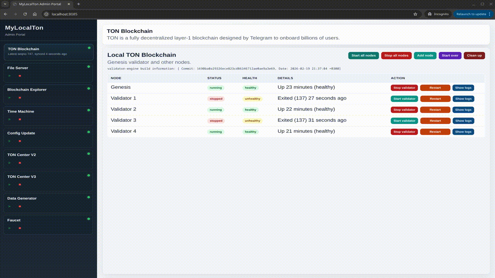

# MyLocalTon Docker

MyLocalTon allows you quickly to set up and launch your own [TON blockchain](https://github.com/ton-blockchain/ton) with
up to 6 validators.
To facilitate the development process it also includes services like
[TON-HTTP-API V2](https://github.com/toncenter/ton-http-api), [TON Indexer V3](https://github.com/toncenter/ton-indexer),
Time Machine, Admin Portal, Faucet, Config Update and Random Data Generator.
Session Stats can also be enabled to visualize validator-engine session logs.



## Prerequisites

Installed [Docker Engine](https://docs.docker.com/engine/install/)
or [Docker Desktop](https://www.docker.com/products/docker-desktop/).

## Usage

### Quick start

[Download](./docker-compose.yaml) and start the main `docker-compose.yaml` file.

```bash
wget https://raw.githubusercontent.com/neodix42/mylocalton-docker/refs/heads/main/docker-compose.yaml
wget https://raw.githubusercontent.com/neodix42/mylocalton-docker/refs/heads/main/.env
```

Modify `.env` file as per your requirements (see below
and [wiki](https://github.com/neodix42/mylocalton-docker/wiki/Genesis-setup-parameters)).
By default, MyLocalTon uses official [TON](https://github.com/ton-blockchain/ton) image with the `latest` tag (based on
`master` branch).

You can change it by setting TON_BRANCH in .env file. For example to `testnet`.

```bash
docker compose up -d
```

Now you can navigate to Time Machine by opening http://localhost:8083.

By default, the following services will be available on start:

| Service name        | Link                                                                                     | 
|---------------------|------------------------------------------------------------------------------------------|
| Admin Portal        | http://127.0.0.1:8085/                                                                   |
| Time Machine        | http://127.0.0.1:8083/                                                                   |
| Global config       | http://127.0.0.1:8000/localhost.global.config.json                                       | 
| TON-HTTP-API V2     | http://127.0.0.1:8082/api/v2/                                                            | 
| Blockchain explorer | http://127.0.0.1:8080/last                                                               |
| Config update       | http://127.0.0.1:8084/                                                                   |
| Http File Server    | http://127.0.0.1:8000/                                                                   |
| Lite-server         | `lite-client -a 127.0.0.1:40004 -b E7XwFSQzNkcRepUC23J2nRpASXpnsEKmyyHYV4u/FZY= -c last` |
| Faucet              | http://127.0.0.1:88                                                                      |
| Data generation     | http://127.0.0.1:99/                                                                     |
| Indexer API v3      | http://127.0.0.1:8081/                                                                   |
| Session Stats       | http://127.0.0.1:18000/                                                                  |

### Deploying optional services

To deploy optional services, you may use Compose profiles

```
docker compose --profile indexer --profile data --profile faucet --profile config-update up -d
```

or change `COMPOSE_PROFILES` variable in `.env` file.

Available profiles:

- `admin-portal`: deploys Admin Portal service
- `blockchain-explorer`: enables default native TON blockchain explorer
- `lite-server`: deploys external TON lite-server, by default one runs as embedded inside genesis container
- `time-machine`: deploys Time Machine service
- `config-update`: deploys web UI for reading/updating TON config params
- `faucet`: deploys faucet service to get grams to some special address
- `data`: generates some activity with TON, Jettons and NFTs
- `validators-<N>`: launches N validators in addition to genesis node, for example `validators-2` enables 2 additional
  validators.
- `indexer`: deploys TON Center API v3
- `indexer-minimal`: deploys API v3 without a trace classifier
- `session-stats`: deploys Session Stats on port 18000
- `native-load-generator`: sends native transfers from a separate container over persistent lite-server connections

### Native session stats

The `side` configuration uses `ghcr.io/neodix42/ton-session-stats:side`, reads
`log.session-stats` from the genesis validator volume, and enables private-network and
native-fast-path metrics. Start it alongside an already running genesis validator:

```bash
docker compose --profile session-stats up -d session-stats
```

Open <http://127.0.0.1:18000/>. Canonical TPS is calculated from consensus-selected
blocks anchored by the masterchain; valid candidates that lose consensus are excluded.
The dashboard also exposes accepted-block size, native transfers per block, external
message outcomes, and collation/validation timings and throughput.

### Native high-rate load

Set `NATIVE_LOAD_*` values in `.env`, create a fresh genesis so the requested source/destination accounts exist in the zero state, then start the load container against the already-running network:

```bash
docker compose --profile native-load-generator up --build native-load-generator
```

The generator reads `/usr/share/data/global.config.json` from the shared config volume and read-only load keys from the dedicated `native-load-wallets` volume. It never runs inside the validator container and cannot read the validator database or validator keys. Account nonces are discovered from proof-checked canonical state by default. `NATIVE_LOAD_SIGNERS` controls parallel in-memory Ed25519 signing, `NATIVE_LOAD_SUBMIT_BATCH_SIZE` amortizes liteserver round trips, and `NATIVE_LOAD_SUBMIT_SOURCE_RUN_SIZE` groups ascending nonces from one source so one pinned account lookup can validate a run. `TON_NATIVE_EXECUTOR_THREADS` controls validator admission/execution workers. `NATIVE_LOAD_ADAPTIVE_INITIAL_RTT_SECONDS` seeds the application congestion window from the measured admission RTT. `NATIVE_LOAD_ADAPTIVE_MAX_CWND` is a global message-count ceiling distributed exactly across generator workers and connections; zero preserves the historical inflight-only limit. It limits admission pressure, while `NATIVE_LOAD_INFLIGHT` remains the separate end-to-end unresolved/proof backlog bound. Global and per-source canonical backlog limits pause new offers before nonce-ordered mempool work grows without bound. The proof-checked canonical block follower drives that backpressure and distinguishes pending duplicates from canonical too-old responses. Its independent query timeout and bounded reconnect policy are configured with `NATIVE_LOAD_CANONICAL_QUERY_TIMEOUT_SECONDS` and `NATIVE_LOAD_CANONICAL_RETRY_*`; recovered transport timeouts remain visible but do not invalidate an otherwise complete proof-checked run. The laptop defaults are deliberately conservative. Metrics are printed as JSON once per configured report interval and distinguish offered, batched wire queries, mempool admission, canonical-chain inclusion, repair work, backpressure, and proof-checked masterchain-anchored source nonces.

The generator issues one fair, bounded contiguous nonce burst per source turn and
waits `NATIVE_LOAD_SUBMIT_COALESCE_MS` (2 ms by default) for signer completions
before assembling a batch. A retrying lowest unresolved admission task blocks
newer unsent tasks from that source, but an already admitted nonce is removed
from the admission head and does not prevent later batches from pipelining while
canonical proof catches up. `source_issue_burst_*`,
`head_blocked_ready_notifications`, `ready_source_queue_*`, per-source cap
gauges, and typed task/retry reasons make both batch underfill and head-of-line
tails explicit. The legacy `head_blocked_ready_scans` counter remains zero when
the source-head queue is operating correctly.

The tracked physical profile uses a 20 ms coalescing window. Cycle 4's 2 ms
window averaged only 3.17 messages per 64-message batch and caused 1.08 million
liteserver queries for 3.42 million wire attempts. Twenty milliseconds remains
below that run's 50 ms median admission RTT, so Cycle 5 uses it to reduce
per-query state pinning and actor scheduling pressure while preserving the same
message batch and source-run limits.

Cycle 5 improved the wire batch average to 8.70, but its uncapped aggregate
CWND still reached 1,593 messages while the validator had acceptance gaps near
65 seconds. The physical profile therefore caps adaptive growth at 768
messages: exactly one complete 64-message batch for each of 12 connections.
The JSON stream and `generator-summary.json` expose the configured and effective
cap, clients currently at the cap, ACKs clipped by it, and the sampled CWND peak.

`TON_SIMPLEX_MAX_TPS=1` is an explicit saturation-only mode used by the physical
profile. It makes the native basechain/shardchain work-driven and publishes each
successful candidate immediately; it does not unpace the masterchain, which
retains its normal target-rate and minimum-interval rules. For the work-driven
shardchain, `SIMPLEX_TARGET_RATE_MS` is not a successful-block interval.
`TON_SIMPLEX_MAX_TPS_CANDIDATE_TIMEOUT_MS` is the outer failure/cancellation
budget for one work-driven candidate. The local-work budget is 80% of that
outer timeout. `TON_SIMPLEX_MAX_TPS_FINALIZE_RESERVE_MS` sets a guarded,
best-effort sealing interval at the end of the local-work budget: at the intake
cutoff, the collator stops admitting another native fragment and seals the last
valid checkpoint. A fragment already executing is non-preemptible. The
physical profile's 8000 ms outer timeout gives 6400 ms of local work; its 1000
ms reserve plus the fixed 100 ms fragment-start guard cuts off new-fragment
intake at 5300 ms, targets a 1000 ms sealing interval, and retains the outer
1600 ms consensus margin. `native_deadline_seals`, `native_deadline_deferred`, and
`native_deadline_first_fragment_commits` in
`validator-pipeline-summary.json` show whether this path was exercised.
`TON_NATIVE_COLLATOR_QUEUE_LIMIT` controls how many native messages are made
available to one collation pass. `TON_NATIVE_MEMPOOL_MAX_TTL` is a safety cap,
while each native transfer's `valid_until` remains the effective expiry. Keep
`NATIVE_LOAD_VALID_FOR_SECONDS` longer than ramp, warm-up, measurement, and
drain combined.

Size arithmetic must use the same layer on both sides. A signed native external BoC is 176 bytes. Inside a v4 batch, 512 transfers serialize to 101,399 bytes with unique endpoints (198.0 bytes/transfer), or 81,456 bytes with a shared destination (159.1 bytes/transfer). Those batch sizes include the compact account table, but they are not complete block costs: the block also carries the updated `ShardAccounts` dictionary, Merkle/proof cells, headers, and limit-estimator allowance. Use the measured `actual_block_bytes_per_transfer` and `estimated_block_bytes_per_transfer` in `validator-pipeline-summary.json` when dividing the configured block limit; never divide it by the 104-byte transfer leaf alone.

`run-native-benchmark.sh` reuses an already-running healthy `genesis` container
when its Compose configuration and local image match the requested environment.
Before creating a result directory, it rejects a missing local TON base image
or one without a source-revision label.
On a mismatch it loudly recreates the container with the requested runtime
configuration while preserving named and bind-mounted volumes. Set
`BENCHMARK_STRICT_GENESIS_REUSE=1` to fail instead, or
`BENCHMARK_RECREATE_GENESIS=1` to force recreation even when it matches. The
wrapper builds the generator before opening the sample window, starts Session
Stats and a fresh generator, and writes its final bundle under
`benchmark-results/<UTC>/`. In addition to generator, Session Stats, and
resource summaries, the bundle contains `validator-session-stats.jsonl` and
`validator-pipeline-summary.json` with all-run and exact measured-window
actual/estimated block sizes plus per-stage collation/validation timing
distributions. `validator-scheduling-summary.json` derives cadence and
consensus wall times from structured `consensus.stats.events` even when normal
validator verbosity suppresses INFO summaries; its provenance section states
that internal actor wake/timer reasons are not observed.

`BENCHMARK_EXT_MESSAGES_BROADCAST_DISABLED` is an opt-in, host-side experiment
control. Leaving it unset is backward-compatible and performs no validator
configuration query. Explicit `0` and `1` both run the same guarded control
path after `genesis` is healthy and before every pre-load snapshot; `1` disables
external-message broadcasting for the run and `0` is the paired control. This
host variable is not read from the Compose `--env-file`, so pass it on the
command line. For a fresh paired comparison, use the same source, image,
profile, and sampler settings:

```bash
sudo env BENCHMARK_EXT_MESSAGES_BROADCAST_DISABLED=0 ./benchmark/run-fresh-native-cycle.sh .env.physical
sudo env BENCHMARK_EXT_MESSAGES_BROADCAST_DISABLED=1 ./benchmark/run-fresh-native-cycle.sh .env.physical
```

The wrapper requires the console command's known connection preamble followed
by one exact `success` reply, waits a fixed five seconds for actor propagation,
and verifies both the validator's
in-memory `get-config` view and persisted `/var/ton-work/db/config.json`. It
rechecks the requested value after the post-drain actor and validator snapshots,
then restores and verifies the safe default `0`. The EXIT handler retries that
cleanup on errors and signals without replacing an earlier nonzero benchmark
status; an otherwise successful run fails closed if restoration cannot be
verified. SIGKILL or host loss cannot run a shell trap, so follow either with a
guarded fresh cycle (which deletes the exact benchmark volumes) or manually set
the validator control back to `0` before reusing the database.

The raw command/config artifacts and hashes are indexed by
`validator-ext-messages-broadcast.json`. The same lifecycle object appears as
`ext_messages_broadcast` in `run-metadata.json` and `benchmark-summary.json`.
For an explicit control its `lifecycle_valid` stays `null` until post-load
readback and restoration both complete; failed restore attempts remain in
attempt-numbered command and readback artifacts even if cleanup retry succeeds.
Whole-config hashes are provenance only because unrelated validator config can
evolve during a run; the hard gate is agreement of the normalized boolean in
both readbacks. In this one-validator topology, mode `1` keeps direct liteserver
injection, local ExtMessagePool admission, and collation intact while removing
redundant external-message gossip work. Label such results as a local
single-validator no-gossip diagnostic, not multi-validator or production-network
capacity.

For a 24-vCPU/128-GB/2-TB physical desktop, use the tracked `.env.physical`
profile. It keeps every published management endpoint on loopback, assigns
whole SMT core pairs to the validator and generator, and leaves native spam
disabled until its profile is started explicitly. First build the matching TON
source checkout as the local tag selected by `.env.physical`:

```bash
cd ../corton-nommander-ton-sidechain
docker build \
  --build-arg PORTABLE=0 \
  --build-arg TON_ARCH=native \
  --build-arg NINJA_JOBS=20 \
  --build-arg VCS_REF="$(git describe --always --dirty)" \
  --build-arg VCS_DATE="$(git show -s --format=%cI HEAD)" \
  --build-arg BUILD_DATE="$(date -u +%Y-%m-%dT%H:%M:%SZ)" \
  -t ghcr.io/corton-nommander/ton:max-tps-native .
```

Then return to this repository and run the controlled benchmark baseline and
telemetry collection with exactly:

```bash
cd ../MyLocalTonDocker
sudo ./run-native-benchmark.sh .env.physical
```

Docker Desktop CPU, memory, and virtual-disk allocations are outside Compose;
verify that they expose the intended capacity and enough free disk before a
sustained run. Verify the checked-in SMT sibling pairs with
`lscpu -e=CPU,NODE,SOCKET,CORE`; remap the CPU sets if the host topology differs.
`.env.desktop` may still be used as a local, untracked override, but the
documented benchmark and its metadata use `.env.physical`.

The profile leaves optional services disabled so an ordinary `up` cannot
accidentally start load. The configured run has a 60-second ramp, 60-second
warm-up, 30-minute measured phase, and up to 10 minutes to drain/reconcile
(42 minutes of configured phases, plus initial nonce discovery).

The same-host baseline allocates 18 vCPU (nine complete SMT core pairs) to
genesis, 4 vCPU to the generator, and caps Session Stats at 1 vCPU on the
remaining SMT pair. Valid Cycle 1 used about one generator core at 4k TPS, and
Cycle 3 still peaked below two generator cores while genesis repeatedly reached
its old 16-vCPU allocation. Moving one physical core pair to the candidate and
canonical path addresses the measured imbalance without constraining the load
source. The validator runs 16 scheduler threads, leaving two of its allocated
CPUs for database and network work. The first 4k
TPS target is requested offered load, not a claim that 4k was produced.
Use the reported maximum and sustained `sign_tps`, `offered_tps`, and
canonical-chain TPS to prove which component reached its ceiling. Larger hosts
should scale the CPU sets and quotas explicitly after checking NUMA and sibling
topology.

Require one valid, fully drained result with no candidate deadline failures at
each step before increasing offered load. Keep the checked-in 4k baseline for
the first command above, then run the same profile with shell overrides:

```bash
sudo env NATIVE_LOAD_TARGET_TPS=6000 ./run-native-benchmark.sh .env.physical
sudo env NATIVE_LOAD_TARGET_TPS=10000 ./run-native-benchmark.sh .env.physical
sudo env NATIVE_LOAD_TARGET_TPS=15000 ./run-native-benchmark.sh .env.physical
```

Stop the staircase at the first invalid run or when canonical backpressure,
candidate deadline sealing, or deadline failures recur; changing several
capacity variables at once makes the limiting stage ambiguous.

For a deliberately fresh source-build plus benchmark cycle, use the guarded
runner. It pins the Compose file and project and refuses to delete anything
unless the resolved model contains exactly the expected services, named
volumes, and named genesis database mount. This permanently deletes the local
chain, generated load wallets, and Session Stats database for
`mylocalton-desktop`:

```bash
sudo ./benchmark/run-fresh-native-cycle.sh .env.physical
```

The physical profile gives genesis a 30-minute health-check start period because
sequential generation of 49,152 fresh wallet keys takes about 23 minutes on the
reference desktop. The wrapper therefore remains attached to the same clean
cycle until genesis becomes healthy instead of requiring a second invocation.
The guarded runner prebuilds both derived images before deleting state and marks
them as prebuilt for the benchmark wrapper, avoiding redundant context hashing
and builds after the destructive boundary.

The native collation queue is conservatively capped at 18,432 messages and the
zero-state block soft/hard limits are 8.5/9 MiB. These leave serialized headroom
below the 10 MiB consensus maximum, reinforced by the validator's native
candidate size-reserve guard. Admission uses a 90-second elapsed retry horizon,
more than twice the longest 31.5-second consensus pause observed in Cycle 2.
The exact canonical-state-lag response has a separate 250ms-to-2s bounded
backoff and does not reduce the AIMD window. A source whose nonce head remains
unresolved at the horizon is quarantined and makes the benchmark invalid rather
than stranding every source in a global ready-task scan.

It writes `benchmark-results/<UTC timestamp>/benchmark-summary.json`, the full
generator log, generator peaks/final JSON, an independent Session Stats canonical
summary, and continuous host/container samples.
CPU is summarized as Docker percent, equivalent cores, and percentage of total
host capacity; RAM includes average and maximum use. The wrapper returns the
generator's exit code, or `3` when either its canonical completion invariants or
the validator's canonical-cleanup invariants fail, so an unsettled drain,
incomplete canonical run, missing cleanup snapshot, or nonempty native pool
remains a failed benchmark.
Raw and summarized telemetry also covers per-CPU utilization, bounded top
validator/generator threads, cgroup-v2 CPU throttling/PSI/memory/OOM/I/O, and
physical block-device counters. Cumulative network and I/O deltas are split
across monotonic segments, so Docker's possible all-zero post-exit sample cannot
erase the run total. `run-metadata.json` records Compose hashes, Git state,
Docker/Compose versions, CPU/SMT/NUMA topology, image IDs, registry digests, and
OCI source labels. Dirty source or unpinned images are reported as separate
reproducibility reasons; they never change proof correctness.

The wrapper also serializes `get-actor-stats` queries during generator execution
to catch actor monopolies that aggregate CPU samples hide. The default cadence is
30 seconds (`BENCHMARK_ACTOR_STATS_SAMPLE_SECONDS=30`) with a two-second
server-side command timeout (`BENCHMARK_ACTOR_STATS_TIMEOUT_SECONDS=2`). The
timeout must remain below the cadence and is hard-capped at five seconds. Calls
never overlap: a slow call consumes its cadence interval, and the final query is
issued only after the periodic collector has exited. Controlled low-perturbation
cycles use `BENCHMARK_ACTOR_STATS_SAMPLE_SECONDS=3600`; that suppresses ordinary
periodic queries during the current workload while retaining the explicit
pre-load, measurement-end, and post-drain snapshots. Once the generator publishes
its absolute measurement boundary, the collector schedules that serialized
sample independently of the periodic cadence. Compact
during-load records go to `validator-actor-stats.jsonl`; unmodified pre-load and
post-drain console responses are kept in `validator-actor-stats-pre-load.txt` and
`validator-actor-stats-final.txt`; and `validator-actor-stats-summary.json`
reports query failures/timeouts, observed query wall fraction, and `OverlayImpl`
load, execution-message/time maxima, single-message time, delay, currently
executing time, the opt-in actor-runtime quantum rate
`actor_mailbox_quantum_yield.qps`, `overlay_traffic_fairness_yield.qps`, and the Cycle 8 FEC-path
rates `overlay_fec_generated_callback.qps`,
`overlay_fec_signed_callback.qps`, and `overlay_fec_fairness_yield.qps`.
The same raw records and boundary snapshots also expose `ton::DecryptorAsync`
load/messages, execution-message/time maxima, single-message time, delay, and
alive/executing state so crypto-worker pressure can be separated from Overlay
mailbox pressure. Images predating the mailbox or FEC counters report those
fields as `null`; actor-stat output without `DecryptorAsync` reports null
snapshots, zero parsed samples, and null maxima rather than weakening the benchmark.
These samples are deliberately best-effort diagnostics and never affect proof,
capacity, cleanup, or reproducibility acceptance. Their configured and observed
sampling cost is repeated under `benchmark-summary.json.validator_actor_stats`
so results can be rejected if measurement perturbation is excessive.

`validator-pool-summary.json.canonical_reconciliation` proves the validator's
native-message cleanup boundary. Local `blockAccepted` callbacks only track
reversible source/nonce hints; the pool purges a nonce prefix only after the
shard client has applied the masterchain-referenced shard state and read that
source's canonical account nonce. A complete run requires zero final
`pending_sources`, zero native pending messages, and proof resolution of the
complete offered-hash cohort; an admission response lost after storage may be
classified later from canonical proof rather than double-counted as admission.
This catches candidates that were locally accepted but replaced by a later
catchain session. Reconciliation publishes a whole basechain shard-top
fingerprint only after a fully successful scan. Masterchain states with the
same fingerprint increment `unchanged_state_skips` before source grouping;
when only part of a multi-shard topology changes, the per-shard fallback uses
`unchanged_top_skips` and `unchanged_source_skips`. An incomplete or failed
scan publishes neither cache, so the same top remains retryable and the
existing failure and pending-source counters still fail closed.

`validator-pool-summary.json.batch_admission.shard_state_cache` reports the
exact immutable shard-state cache as run deltas. `shard_state_requests` is the
logical lookup count, `shard_cache_hits` is the cached subset, and
`shard_manager_waits` counts logical cache misses handed to ValidatorManager.
A manager wait may hit its own positive cache or join its exact-`BlockIdExt`
worker, so this is deliberately not a physical DB or network read count.
`shard_fetches` remains a deprecated equal-value compatibility alias. The
summary publishes hit/manager-wait ratios and the invariant error
`shard_state_requests - shard_cache_hits - shard_manager_waits`.

`shard_miss_errors` is the canonical aggregate miss-resolution error counter;
`shard_fetch_errors` is its deprecated equal-value alias. The manager-await
subset is split into `shard_manager_wait_timeouts`,
`shard_manager_wait_notready`, and `shard_manager_wait_other_errors`, while
`shard_manager_wait_late_results` counts successful awaits observed after the
caller's absolute deadline and rejected before validation or cache insertion.
The derived report checks both alias pairs, the error-breakdown identity, and
the complete miss-outcome identity including fills, non-conflicting fill
races, stale-generation skips, errors, and late results. It also exposes
generation resets, validation counters, final/current peak entry gauges, and
validation-or-store errors outside the manager-await subset. Cycle 12's full
cache captures remain readable by falling back to its `shard_fetches` and
`shard_fetch_errors` names, but naturally report the new detailed manager-wait
outcomes as unavailable. Images predating that full cache contract retain the
raw `before`, `after`, and `delta` objects but set this derived summary's
`capture_complete` to `false` and its counters and ratios to `null`.

Every collated basechain/masterchain view in `validator-pipeline-summary.json`
also has `external_wait_breakdown`. This wall-clock-only summary totals the ten
mutually exclusive queue lifecycle categories (`round_live`,
`round_native_coalescing`, `generic_try_pop`, `generic_sync_snapshot`,
`native_probe`, `native_first_work`, `native_fragment_refill`,
`native_post_commit_idle`, `native_producer_drain`, and
`native_sync_snapshot`), their call counts and fractions, and reconciles their
sum plus `external_wait_accounted_s` with the existing `wait_externals_time`.
`accounting_within_tolerance` requires all three comparisons to agree within
`max(0.0001 seconds, 0.1%)` independently for every collated record, so signed
errors from different records cannot cancel. The aggregate view retains each
signed error total, the sum of the per-record tolerances in
`accounting_tolerance_envelope_s`, and the largest per-record error across all
three comparisons in `max_per_record_absolute_accounting_error_s`. The gate is
diagnostic and does not change benchmark acceptance. Legacy or mixed records keep the existing
`wait_externals_time_s` distribution and report unavailable derived totals as
`null` with `capture_complete:false`.

`benchmark-summary.json.acceptance` keeps canonical proof correctness, complete
settled execution, ingress-capacity validity, chain-capacity validity,
validator canonical cleanup, and reproducibility as independent decisions.
Each failed decision has stable reason codes. Missing reconciliation or pending
pool snapshots fail closed rather than silently accepting an old image or a
failed validator-console query. A literal JSON `false` is retained as false,
not converted to null. Run `./run-native-benchmark.sh --self-test` to exercise
the report invariants without Docker.
Treat `canonical_chain_measure_peak_1s_tps` and
`canonical_chain_measure_avg_tps` as the generator's proof-checked chain
throughput fields. Session Stats stores validator samples in minute buckets, so
the wrapper uses it to independently corroborate the canonical transfer total
and maximum transfers per block, not exact run-boundary or one-second TPS.
`mempool_accept_tps` is admission only, while
`canonical_follower_discovery_tps` is observer catch-up speed and is deliberately
not reported as production TPS.
Canonical one-second peaks use only complete integer `gen_utime` buckets fully
contained in the millisecond measurement window. The final
`canonical_gen_utime_bucket_{start,end,duration}` fields publish those exact
boundaries; partial first and last seconds are excluded. Session Stats still
queries explicitly reported padded minute boundaries and remains corroboration,
not the exact-window TPS authority.
If `canonical_follower_lag_blocks` is nonzero at the end, the proof observer did
not catch the anchored shard tip and the run is invalid. Canonical backpressure
by itself is not classified as observer-limited: it can be the expected signal
that offers outran chain inclusion. When it engages, compare follower lag and
block discovery rate with canonical block rate and backlog before deciding
whether the observer or the chain set the ceiling.

The physical desktop profile keeps Session Stats, management, optional UIs,
liteserver, and the file endpoint on `127.0.0.1`. Set
`TON_DB_VAL0_HOST_DIR` to an existing absolute
directory on the dedicated NVMe before genesis creation. Leaving it empty
keeps the portable `ton-db-val0` named volume. When using a host bind with
session-stats, set `TON_WORK_HOST_DIR` to the same path and clear
`TON_WORK_DOCKER_VOLUME`. Source count, native wallet volume, shard layout,
and block limits are genesis inputs: changing them for an existing network
does not retrofit its zero state, so recreate the test network volumes before
comparing a new profile. Max-TPS mode, its candidate and finalize-reserve
timeouts, the native collation queue limit, and native mempool TTL are validator
runtime settings. The wrapper reconciles the validator container so these
values take effect, but does not delete or regenerate zero-state volumes.

`.env.physical` selects the `max-tps-native` tag and sets
`TON_BUILD_PULL=false`, so derived-image builds use that exact local base rather
than trying to replace it from a registry. The wrapper checks that the local
base exists, rebuilds the derived genesis image before deciding whether a
running validator can be reused, and rejects an older image that lacks the
saturation-generator CLI. For final published numbers, also push and pin an
immutable digest. Larger build hosts may raise `NINJA_JOBS` from the desktop's
20-job baseline.

`assembly/native/build-ubuntu-shared.sh -t` remains useful for a direct host
build/test, but the container benchmark consumes the Docker image above.

Native batch v4 signatures are bound to the network zero-state root and are
required at global version 14. Use the same updated TON image on every
validator and load-generator container, and create a fresh genesis when moving
an older test network to this protocol; mixing old and new binaries is not a
valid benchmark or deployment.

### Containers' description and startup parameters

Adjust parameters in `.env` file or edit `docker-compose.yaml` for relevant changes.

<table>
<tbody>
<tr>
<th>Container</th>
<th>Parameters</th>
<th>Description</th>
</tr>
<tr>
<td>genesis</td>
<td>
<ul><li><b>EXTERNAL_IP</b> - used to generate <b>external.global.config.json</b> that allows remote users to connect to lite-server via  public IP. Default <b>empty</b>, i.e. no <b>external.global.config.json</b> will be generated;</li> 
<li><b>VALIDATION_PERIOD</b> - set validation period in seconds, default <b>1200 (20 min)</b>; </li>
<li><b>MASTERCHAIN_ONLY</b> - set to <b>true</b> if you want to have only masterchain, i.e. without workchains, default <b>false</b>; </li>
<li><b>DHT_PORT</b> - set port (udp) for dht server, default port <b>40004</b>, optional.</li>
<li><b>CUSTOM_PARAMETERS</b> - used to specify validator's command line parameters, default - empty string (no parameters),  optional. </li>
</ul>
You can also adjust other blockchain settings, like storage or cell creation price, initial blockchain balance and so
on.

The whole list of supported parameters can be
found <a href="https://github.com/neodix42/mylocalton-docker/wiki/Genesis-setup-parameters">here</a>.
</td>
<td>
This is the very first and default validator of initial TON blockchain. 
It creates the so-called zero state with specified parameters.
The default parameters for this local TON blockchain are the same as in the Mainnet.
</td>
</tr>
<tr>
<td>admin-portal</td>
<td>
<ul>
<li><b>SERVER_PORT</b> - used by admin portal service, default port <b>8085</b>, optional;</li>
</ul>
</td>
<td>
This is the face of MyLocalTon Docker.
This service provides a web UI to monitor and start/stop MyLocalTon services, as well as TON nodes from one place.
</td>
</tr>
<tr>
<td>time-machine</td>
<td>
<ul>
<li><b>SERVER_PORT</b> - used by time machine service, default port <b>8083</b>, optional;</li>
</ul>
</td>
<td>
Here you can take the snapshots of your TON blockchain and navigate between them as you like,
or you can use it simply to stop and start the blockchain, as well as to customize and start it from scratch. 
</td>
</tr>
<tr>
<td>config-update</td>
<td>
<ul>
<li><b>SERVER_PORT</b> - used by config update service, default port <b>8084</b>, optional.</li>
</ul>
</td>
<td>
This service provides a web UI to read and update TON blockchain configuration parameters via ton4j.
REST API endpoints:
<ul>
<li><b>GET /api/config/params</b> - list supported config parameters.</li>
<li><b>GET /api/config/supported</b> - alias of <b>/api/config/params</b>.</li>
<li><b>GET /api/config/seqno</b> - return current seqno of config smart contract.</li>
<li><b>GET /api/config/{id}</b> - fetch schema and current value for a config parameter.</li>
<li><b>POST /api/config/{id}</b> - submit updated value for a config parameter (JSON body: <code>{"value": ...}</code>).</li>
</ul>
</td>
</tr>
<tr>
<td>faucet</td>
<td>
<ul>
<li><b>FAUCET_USE_RECAPTCHA</b> - if <b>false</b> faucet will not use recaptcha as protection, mandatory, default <b>true</b>;</li>
<li><b>RECAPTCHA_SITE_KEY</b> - used by local http-server that runs faucet service, mandatory;</li>
<li><b>RECAPTCHA_SECRET</b> - used by local http-server that runs faucet service, mandatory;</li>
<li><b>FAUCET_REQUEST_EXPIRATION_PERIOD</b> - used by local http-server that runs faucet service, default <b>86400</b> seconds (24h), optional;</li>
<li><b>FAUCET_SINGLE_GIVEAWAY</b> - used by local http-server that runs faucet service, default <b>10</b> grams, optional;</li>
<li><b>SERVER_PORT</b> - used by local http-server that runs faucet service, default port <b>88</b>, optional.</li>
</ul>
</td>
<td>
This services allows users to get test grams.
</td>
</tr>
<tr>
<td>data</td>
<td>
<ul>
<li><b>SERVER_PORT</b> - used by data generation service, default port <b>99</b>, optional;</li>
<li><b>PERIOD</b> - period in minutes on how often to run all scenarios.</li>
</ul>
More details
  on <a href="https://github.com/neodix42/mylocalton-docker/wiki/Data-(traffic-generation)-container)">wiki</a>.
</td>
<td>
This services runs various scenarios that generate random load on a blockchain.
</td>
</tr>
<tr>
<td>blockchain-explorer</td>
<td>
<ul>
<li><b>SERVER_PORT</b> - used by local TON blockchain-explorer, default port <b>8080</b>.</li>
<li><b>FILE_SERVER_IP</b> - used by local TON blockchain-explorer to find File Server and download global config, default IP <b>172.28.1.24</b>.</li>
<li><b>FILE_SERVER_PORT</b> - used by local TON blockchain-explorer, to specify port of File Server, default port <b>8000</b>.</li>
</ul>
</td>
<td>
This is a simple, but native TON blockchain explorer.
</td>
</tr>
<tr>
<td>lite-server</td>
<td>
<ul>
<li><b>LITE_SERVER_PORT</b> - this port opened to lite-client for connections, default port <b>30004</b>.</li>
<li><b>CONSOLE_PORT</b> - this port opened to validator-console, default port <b>30002</b>.</li>
<li><b>PUBLIC_PORT</b> - used by node in this container, default port <b>30001</b>.</li>
</ul>
</td>
<td>
A non-embedded standalone lite-server.</td>
</tr>
<tr>
<td>validator-N</td>
<td>
<ul>
<li><b>VERBOSITY</b> - set verbosity level for validator-engine. Default 1, allowed values: 0, 1, 2, 3, 4;
</li>
<li><b>PUBLIC_PORT</b> - set public port (udp) for validator-engine, default port <b>40001</b>, optional;</li>
<li><b>CONSOLE_PORT</b> - set port for validator-engine-console, default port <b>40002</b>, optional;</li>
<li><b>LITE_PORT</b> - set port for lite-server, default port <b>40004</b>, optional.</li>
</ul>
</td>
<td>
These set of containers used to add more validators to the blockchain.
Uncomment sections in the docker-compose.yaml to enable some of them.
The maximum number of validators that can be added is 5.
</td>
</tr>
<tr>
<td>ton-http-api v2</td>
<td>
By default TON HTTP API runs on port <b>8082.</b>
<ul>
<li><b>THACPP_LOG_LEVEL</b> - level, one of trace, debug, info, warning, error, critical (default: warning)</li>
<li><b>THACPP_LOG_FORMAT</b> - format of logs, one of tskv, ltsv, json (default: json)</li>
<li><b>THACPP_MAIN_WORKER_THREADS</b> - number of http service workers</li>
<li><b>THACPP_TONLIB_THREADS</b> - number of tonlib workers</li>
</ul>
</td>
<td>
This is a <a href="https://github.com/toncenter/ton-http-api">TonCenter TON HTTP API</a> service provided by the TON Core team.
In the Mainnet it is accessible via <a href="https://toncenter.com/api/v2/">https://toncenter.com/api/v2/</a>
</td>
</tr>
<tr>
<td>ton-http-api v3, index-worker, index-postgres, index-api, event-classifier</td>
<td>
By default TON indexer V3 runs on port <b>8081</b>.

These containers share below environment variables:
<ul>
<li><b>POSTGRES_PORT</b> - default value <b>5432</b>;</li>
<li><b>POSTGRES_USER</b> - default value <b>postgres</b>;</li>
<li><b>POSTGRES_PASSWORD</b> - default value <b>PostgreSQL1234</b>.</li>
</ul>
See the whole list inside <b>docker-compose.yaml</b> file.
</td>
<td>
This is a <a href="https://github.com/toncenter/ton-indexer">TonCenter TON Indexer V3</a> service provided by the TON Core team.
In the Mainnet it is accessible via <a href="https://toncenter.com/api/v3/index.html">https://toncenter.com/api/v3/index.html</a>
</td>
</tr>
</tbody>
</table>

### Access services

| Service name        | Link                                                                                     | 
|---------------------|------------------------------------------------------------------------------------------|
| Time Machine        | http://127.0.0.1:8083/                                                                   | 
| Admin Portal        | http://127.0.0.1:8085/                                                                   |
| TON-HTTP-API V2     | http://127.0.0.1:8082/api/v2                                                             | 
| TON-HTTP-API V3     | http://127.0.0.1:8081/                                                                   |
| Blockchain explorer | http://127.0.0.1:8080/last                                                               |
| Config update       | http://127.0.0.1:8084/                                                                   |
| Faucet              | http://127.0.0.1:88/                                                                     |
| Session stats       | http://127.0.0.1:18000/                                                                  |
| Traffic generation  | http://127.0.0.1:99/                                                                     |
| HTTP file server    | http://127.0.0.1:8000/                                                                   |
| Lite-server         | `lite-client -a 127.0.0.1:40004 -b E7XwFSQzNkcRepUC23J2nRpASXpnsEKmyyHYV4u/FZY= -c last` |

Global network configuration file available at:

http://127.0.0.1:8000/global.config.json

### Build from sources

```shell
git clone https://github.com/neodix42/mylocalton-docker.git
cd mylocalton-docker
mvn clean install
docker compose build
docker compose up
```

### Go inside the container

```
docker exec -it genesis bash

# connect to validator console
validator-engine-console -a 127.0.0.1:40002 -k  /var/ton-work/db/client -p /var/ton-work/db/server.pub

# connect to lite-server
lite-client -a 127.0.0.1:40004 -p /var/ton-work/db/liteserver.pub

docker exec -it validator-1 bash
docker exec -it validator-2 bash
docker exec -it validator-3 bash
docker exec -it validator-4 bash
docker exec -it validator-5 bash

# each container has some predefined aliases:
last, getstats, config32, config34, config36, elid, participants
```

### Stop all containers

```docker compose down```

The state will be persisted, and the next time when you start the containers up the blockchain will be resumed from the
last state.

You can also stop and start the blockchain from the Time Machine web GUI.

If you want to access validators' TON working directory (`/var/ton-work/db`) or to keep database state even after
rebuilding images,
adjust the `driver_opts` options in `volumes` section in `docker-compose.yaml` file.

### Stop and remove all MyLocalTon containers, networks and volumes.

All data will be lost.

```docker compose -f docker-compose.yaml down -v```

You can also clean up MyLocalTon from the Time Machine web GUI. Use `Clean Up` button.

## Custom MyLocalTon

As it was mentioned above MyLocalTon uses TON image with the `latest` tag,
which is based on the official repository https://github.com/ton-blockchain/ton/ `master` branch.
You can change it by setting TON_BRANCH in .env file, for example to `testnet`.

You can also now build MyLocalTon Docker image based on any fork of TON repository.

Here is the short instruction on how to build and start the customized container:

```
git clone https://github.com/neodix42/mylocalton-docker.git
cd mylocalton-docker
./custom-MyLocalTon.sh <branch> <forked-ton-repo>
e.g. 
./custom-MyLocalTon.sh gh-arm-fix https://github.com/neodix42/ton.git
```

## Pre-installed wallets

To speed up your development process, we created a set of predefined wallets.

These wallets will always be available in the blockchain, and you can use them in your SDK.

| Wallet/Contract Name                        | Wallet                                                                                                                                                                                                                                            | Mnemonic                                                                                                                                                                   |
|---------------------------------------------|---------------------------------------------------------------------------------------------------------------------------------------------------------------------------------------------------------------------------------------------------|----------------------------------------------------------------------------------------------------------------------------------------------------------------------------|  
| main-wallet                                 | Version: V3R2<br/>WalletId: 42<br/>Address: `-1:ee8bd22f43f56e50e0f914cedbd0594ece7ed7a3e8131b73862cab98294c4a21` <br/>Private key: `155e56fcb4a908d7e639dd72b43c8b6c159116393bdb8a65044661fbd1e6e4d6`                                            |                                                                                                                                                                            |
| config-master                               | Address: `-1:5555555555555555555555555555555555555555555555555555555555555555` <br/>Private key: `ea8474240765aedb032132ccce724f93c7c209dba98d62887ecf685e8fbd757c`                                                                               |                                                                                                                                                                            |
| genesis                                     | Version: V3R2<br/>WalletId: 42<br/>Address: `-1:6744e92c6f71c776fbbcef299e31bf76f39c245cd56f2075b89c6a22026b4131` <br/>Private key: `3c5156df1a46a1c84264c5e4019b9172232595936729595da5c15267c0761ba8`                                            | `quantum input cannon actress public limit case torch manage pig wrestle sunny riot midnight mouse romance guitar chat race famous jacket donor empty sad`                 |
| validator-1                                 | Version: V3R2<br/>WalletId: 42<br/>Address: `-1:ac76977d75e874006e37bf1113ff0b111851b1b72217b7e281424d2389be0122` <br/>Private key: `bf97c398d24e3d23a1dcf48120a43f0981ec331cf3e1632ba641157694a9b0c8`                                            | `dentist melt vault invest alcohol argue sausage embrace afford verify control credit waste file hope vocal air ahead gesture wage innocent today party salad`             |
| validator-2                                 | Version: V3R2<br/>WalletId: 42<br/>Address: `-1:061e92aa93905a0e1499dd9964f5c8e06d8bfe349c0dee03c6395b609a9b2e63` <br/>Private key: `bd8343a5338eaa2f4ca327755cc6e23a46dc916db6397c7164abec4fa74470d4`                                            | `involve talk only inform oblige police liberty inform brain daughter erode arrest betray situate gesture curious talent position response window flower car include hunt` |
| validator-3                                 | Version: V3R2<br/>WalletId: 42<br/>Address: `-1:05045ba974ca403d9bf46b4835fd5cbd0a525c366a92cd020ea2af39761d9e99` <br/>Private key: `9b87d2d9356ef460c2a5b7d087ac7753abb7a4080b3bd48898012e92c12603dc`                                            | `prevent farm bottom wasp limb black planet spider glove grunt apart nerve run motor depart kick about exchange delay police saddle image blast satoshi`                   |
| validator-4                                 | Version: V3R2<br/>WalletId: 42<br/>Address: `-1:578a994a4be99fedf40953621cf780d109aea2126de9c1ad5362ece75867a10a` <br/>Private key: `ca76a4fc98b7f0f8dcbcc051b2c44e5ffa46340ba613edf72be50d4bc9bdd9ea`                                            | `tattoo program weird deer minimum replace dwarf blind guess cotton casual tool smooth carbon guide poet uphold cheese stand sunset fetch drink dumb chaos`                |
| validator-5                                 | Version: V3R2<br/>WalletId: 42<br/>Address: `-1:f002d1a5106c751c7346369cda745085253cb9bf009e5769a017a28e2264faab` <br/>Private key: `6d2b9c3d816edb18f7114df57123aa3ad0d4a453ba9e01081635f6d8c58d3cc2`                                            | `alley brass abandon essence boring sing bundle knee image pilot life noodle rough always drastic approve quick spot spy bronze behind include merit mutual`               |
| Faucet wallet                               | Version: V3R2<br/>WalletId: 42<br/>Balance: 1mio grams<br/>Masterchain<br/>Address: `-1:22f53b7d9aba2cef44755f7078b01614cd4dde2388a1729c2c386cf8f9898afe` <br/>Private key: `a51e8fb6f0fae3834bf430f5012589d319e7b3b3303ceb82c816b762fccf2d05`      | `viable model canvas decade neck soap turtle asthma bench crouch bicycle grief history envelope valid intact invest like offer urban adjust popular draft coral`           |
| Faucet Highload                             | Version: Highload V2<br/>QueryId: 0<br/>Balance: 1mio grams<br/>Masterchain<br/>Address: `-1:5ee77ced0b7ae6ef88ab3f4350d8872c64667ffbe76073455215d3cdfab3294b` <br/>Private key: `e1480435871753a968ef08edabb24f5532dab4cd904dbdc683b8576fb45fa697` | `twenty unfair stay entry during please water april fabric morning length lumber style tomorrow melody similar forum width ride render void rather custom coin`            |
| Faucet Highload (used by traffic generator) | Version: Highload V2<br/>QueryId: 0<br/>Balance: 1mio grams<br/>Masterchain<br/>Address: `-1:10df89757ee2bd09779d876a29b3e8ec4e706f902c9704eea5434d0a165e7ccd` <br/>Private key: `f2480435871753a968ef08edabb24f5532dab4cd904dbdc683b8576fb45fa697` |                                                                                                                                                                            |
| Faucet wallet (basechain)                   | Version: V3R2<br/>WalletId: 42<br/>Balance: 1mio grams<br/>Basechain<br/>Address: `0:1da77f0269bbbb76c862ea424b257df63bd1acb0d4eb681b68c9aadfbf553b93` <br/>Private key: `1bd726fa69d850a5c0032334b16802c7eda48fde7a0e24f28011b22159cc97b7`         | `again tired walnut legal case simple gate deer huge version enable special metal collect hurdle merit between salmon elbow pattern initial receive total slender`         |
| Faucet Highload (basechain)                 | Version: Highload V2<br/>QueryId: 0<br/>Balance: 1mio grams<br/>Basechain<br/>Address: `0:d07625ea432039dc94dc019025f971bbeba0f7a1d9aaf6abfa94df70e60bca8f` <br/>Private key: `d0cc460a43dd4555401cdc562c6f01bf8bb8c0e882037f57fc05683dd85f3013`    | `cement frequent produce tattoo casino tired road seat emotion nominee gloom busy father poet jealous all mail return one planet frozen over earth move`                   |

## Features

* A web GUI interface for snapshots' management and blockchain administration;
* Flexible blockchain startup
  parametrization ([more info](https://github.com/neodix42/mylocalton-docker/wiki/Genesis-setup-parameters));
* Validation
    * automatic participation in elections and reaping of rewards
    * specify from 1 to 6 validators on start
    * the validation cycle lasts 20 minutes (can be changed via env var VALIDATION_PERIOD)
    * by default, elections last 10 minutes (starts 5 minutes after the validation cycle starts and finishes 5 minutes
      before the validation cycle ends)
    * minimum validator stake is set to 100mln;
    * stake freeze period 3 minutes
    * predefined validators' wallet addresses (`V3R2`, subWalletId = `42`)
* Predefined lite-server
    * `lite-client -a 127.0.0.1:40004 -b E7XwFSQzNkcRepUC23J2nRpASXpnsEKmyyHYV4u/FZY= -c last`
* Faucet web server with reCaptcha V2 functionality
    * uncomment section in `docker-compose.yaml` to enable;
    * specify RECAPTCHA_SITE_KEY and RECAPTCHA_SECRET reCaptcha parameters;
    * hardcoded rate limit per session - 10 requests per minute per session.
* Native TON blockchain-explorer:
    * enabled on http://127.0.0.1:8080/last by default
* Integrated TON Index API V2 engine (https://toncenter.com/api/v2/)
* Integrated TON Index API V3 engine (https://toncenter.com/api/v3/index.html)
* cross-platform (arm64/amd64)
* tested on Ubuntu, Windows and MacOS

## TON development using Java

Refer to [ton4j](https://github.com/ton-blockchain/ton4j) SDK.

<!-- @formatter:on -->
**Important!** MyLocalTon-Docker lite-server runs inside genesis container in its own network on IP `172.28.1.10`,
if you want to access it from localhost, you have to refer to `127.0.0.1` IP address or simply use this config:

http://127.0.0.1:8000/localhost.global.config.json
