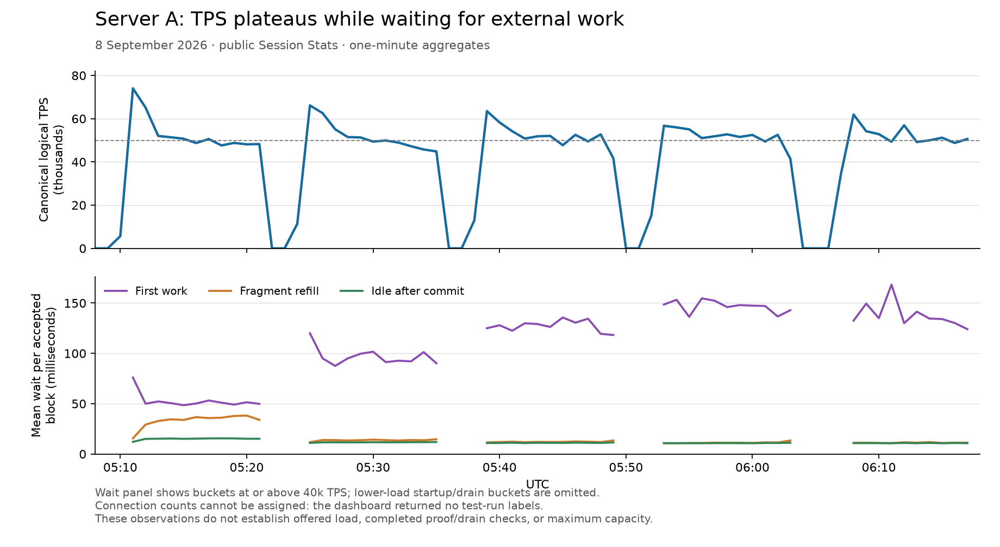

# Native charts and connection scaling — 8 September 2026

The empty native charts are caused by an importer bug, not an absence of native transfers. The running `side` dashboard at source `097428e` requires accepted external-message count to equal transaction count. NTRN carries several logical transfers in one signed parent, so it fails that scalar-only condition.

The current public API confirms this. At 05:18 UTC, accepted blocks contained **2,857,104 logical transfers in 178,569 signed parents** across 1,424 blocks. Native execution counters independently match the logical transfer count. Nevertheless, the native TPS and transfers-per-block series are zero, while native bytes/transfer and service-rate series have no samples. These are real minute aggregates, not an individual-block fixture.

## Dashboard correction

Session Stats commit `97c4f771047aa4a970b5582347413346fdfbf8bb`:

- Uses `block_stats.transactions` as the logical count for signed-run blocks with zero gas and positive native execution evidence. It never multiplies all parents by 16, so short runs remain correct.
- Preserves explicit native counts and the legacy scalar path. Zero-valued native fields alone cannot classify a positive block.
- Repairs native collation, validation and canonical samples with independent phase markers. Repeated imports do not add those samples twice or replay the existing canonical transaction totals.
- Keeps all requested charts because they are useful. The bytes and service-rate labels distinguish per-block ratios from chain TPS. A new chart shows first-work, refill and post-commit idle waits in seconds per accepted block.
- Skips boolean flags as durations and excludes counters/nested native timers from the timing `other` residual for newly imported general events.
- Normalizes API windows to at least 60 seconds and whole-minute multiples. The old API could divide a stored minute total by a requested one-second window, inflating a rate by 60×. The observations below used the correct 60-second window.
- Serializes periodic and manual importers with an advisory database lock.

All **16 tests passed without skips**. Independent review additionally exercised migration through the actual previous importer, simultaneous imports, API input validation and native-chart toggles. Tests preserve canonical fork selection, per-producer validation samples, scalar/empty history and short-run counts.

## What the public run shows

The requested dashboard interval is **04:18:10.765–06:18:10.765 UTC**. Available canonical minute rows begin at 04:50; missing earlier data is not proof of inactivity. `/api/test_runs` returns an empty list, so the five visible bursts cannot be assigned reliably to 10/50/100/300/500 connections. The API does not expose generator settings, offered load or final proof/drain results.

These illustrative sustained portions exclude initial peaks and are **not the generator's official measurement windows**. End times below are exclusive.

| Observed interval, UTC | Mean canonical logical TPS | Mean external wait per accepted block |
| --- | ---: | ---: |
| 05:13–05:22 | 49,584 | 101 ms |
| 05:28–05:36 | 48,610 | 121 ms |
| 05:42–05:49 | 51,020 | 152 ms |
| 05:56–06:03 | 51,652 | 169 ms |
| 06:10–06:18 | 51,106 | 158 ms |



The figure displays a subset of the requested interval. Its wait panel includes only minute buckets at or above 40k TPS, omitting lower-load startup/drain periods. All raw responses are retained in the evidence archive.

At 05:18, the 102.7 ms external wait consists mainly of **51.0 ms waiting for first work, 36.1 ms waiting for a refill, and 15.6 ms idle after commit**. Native execution takes 3.75 ms and native commit 12.78 ms per accepted block in that minute. Later periods spend most of their external wait on first work. This identifies a useful measurement boundary, but that wait alone cannot distinguish an underfeeding client, slow admission, snapshot retries, or a producer that has not published pending work. It does not prove CPU saturation.

The supplied running-node metrics also show **188,726 staged-trie builds, all using one worker**. Updates never exceed 256; the configured parallel threshold is 512. More executor threads alone cannot activate that stage. Benchmark worker tiers at representative sizes before lowering the threshold.

## Why more connections do not multiply TPS

In the current `server48` preset, the total initial/max congestion window stays **32,768/65,536 logical transfers**, and the hard in-flight limit stays 262,144. These budgets are divided across workers and connections. The four payment lanes and single validator are also unchanged.

For intact 16-child parents and the 64-parent RPC batch limit:

| Connections | Per-client logical ceiling at maximum window | Maximum parents in one RPC at that ceiling |
| ---: | ---: | ---: |
| 10 | 6,553–6,554 | 64 |
| 100 | 655–656 | 40–41 |
| 300 | 218–219 | 13 |
| 500 | 131–132 | 8 |

These are configured ceilings, not measured batch densities; actual available credit can be lower. Adding sockets can therefore reduce batching and increase RPC/admission overhead while preserving the same total window. The public dashboard cannot establish whether these exact defaults were used in the current run, or which limit was binding.

The measured waits and fixed budgets make ingress, scheduling and credit availability stronger next investigation targets than simply increasing connection count. Native execution is about 1.58–1.84 wall microseconds per transfer in the selected periods. Accepted block serialization is roughly 79–84 bytes per transfer, equivalent to about 32–34 Mbit/s at 50k TPS before other traffic; this is not a measurement of total network use.

## Next controlled measurement

Keep the source population, workers, signers, connections and prebuilt image fixed. After a clean, fully reconciled run, compare global windows at 10 connections:

```bash
bash run-remote-load.sh --connections 10 --duration 600 \
  --initial-cwnd 32768 --max-cwnd 65536
bash run-remote-load.sh --connections 10 --duration 600 \
  --initial-cwnd 65536 --max-cwnd 131072
```

Repeat in reversed order before keeping a setting. Record exact arm timestamps, offered/admitted/canonical TPS, `wire_batch_avg_size`, RTT, `not_ready_by_reason`, congestion-window/cap counters, source/client issue holds and final proof/drain results. Verify excess offered load before making a capacity claim. Preserve the existing source-reuse failure gates. The previous local wider-window trial was interrupted and supplies no evidence for increasing the default.

If first-work waits remain high despite queued client work, instrument the producer's pending-work age and admission snapshot-versus-account-revision retries. Do not relax consensus/state guards merely to suppress retries.

## Upgrade on A

The fixed image is published. Update only Session Stats between measurements:

```bash
docker compose --env-file .env --profile session-stats pull session-stats
docker compose --env-file .env --profile session-stats \
  up -d --no-deps --no-build --pull never --force-recreate session-stats
```

Keep the current statistics volume and validator process. Active/recent retained logs repair automatically. For older retained archives, after upgrading:

```bash
docker exec -w /app/backend session-stats python update_range.py 0 "$(date +%s)"
```

The manual and periodic importers serialize, so the history scan can delay fresh chart updates until it finishes. Reload the browser afterward. Deleted logs cannot be reconstructed. Legacy scalar periods imported while native metrics were disabled cannot be safely distinguished from already imported native data; that history is preserved conservatively. Historical general timing aggregates remain unchanged. No database reset, TON image rebuild, client export or genesis restart is required for this dashboard fix.

## Evidence

- [Analysis and API provenance](native-chart-scaling-findings-20260908.json)
- [Captured public API responses and plotting script](native-chart-scaling-evidence-20260908.tar.gz)
- [Standalone SVG figure](native-chart-scaling-20260908.svg)

No new load was submitted to either remote server during this investigation. These observations establish neither a new TPS gain nor a maximum-capacity result.

## Published image

[CI run 34197972988](https://github.com/neodix42/session-stats/actions/runs/34197972988) succeeded at 07:13:01 UTC. Anonymous registry verification at 07:14 UTC confirms both AMD64 and ARM64 provenance points to `97c4f771047aa4a970b5582347413346fdfbf8bb`. The public `side` tag resolves to:

```text
ghcr.io/neodix42/ton-session-stats@sha256:ae8cb9d45e841791f51dd82baa8db3e9288b70608467eba35776df55965c0f67
```

[Publication evidence](native-chart-published-image-20260908.json) preserves the CI test count, platform manifests and source attestations. Server A was not changed by this task; its running container needs the update above.
